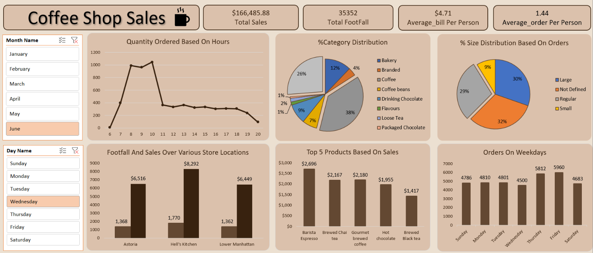

# ☕ Coffee Shop Sales Analytics Dashboard

An interactive **Microsoft Excel Sales Analytics Dashboard** built to analyze **149K+ retail transactions** and transform raw sales data into actionable business insights through KPI reporting, trend analysis, and interactive visualizations.

---

## 📌 Project Overview

Businesses generate thousands of sales transactions every day, making it difficult to monitor performance and identify meaningful trends manually.

This project demonstrates how Microsoft Excel can be used as a Business Intelligence tool to analyze retail sales data, uncover revenue drivers, monitor customer purchasing behavior, and support data-driven decision-making.

The dashboard provides an interactive view of sales performance across stores, products, categories, weekdays, and business hours.

---

## 🎯 Business Objectives

- Monitor overall sales performance using KPIs
- Identify top-performing stores and products
- Analyze customer purchasing behavior
- Discover peak business hours and high-footfall days
- Understand product category contribution to revenue
- Support business decisions through interactive reporting

---

# 📊 Dashboard Preview

---

# 📈 Key Performance Indicators (KPIs)

| KPI | Value |
|------|------:|
| Total Sales | **$166,485.88** |
| Customer Footfall | **35,352** |
| Average Bill per Customer | **$4.71** |
| Average Orders per Customer | **1.44** |

---

# 📊 Dashboard Features

### 📌 Sales Performance Analysis

- Total Sales Overview
- Revenue by Store
- Product-wise Sales Analysis
- Category Distribution
- Sales Trend Analysis

### 📌 Customer Analytics

- Customer Footfall Analysis
- Average Bill Analysis
- Average Orders per Customer
- Peak Sales Hours

### 📌 Product Analytics

- Top 5 Best Selling Products
- Product Category Distribution
- Beverage Size Distribution

### 📌 Time-Based Analysis

- Sales by Hour
- Sales by Month
- Sales by Weekday

### 📌 Interactive Filters

Users can dynamically filter the dashboard by:

- Month
- Day of Week

---

# 🛠 Tools & Technologies

- Microsoft Excel
- Pivot Tables
- Pivot Charts
- Slicers
- Conditional Formatting
- Data Cleaning
- Dashboard Design
- KPI Reporting

---

# 📂 Dataset

The dataset contains **149,000+ retail transactions** with the following attributes:

- Transaction ID
- Transaction Date
- Transaction Time
- Store Location
- Product Category
- Product Type
- Product Name
- Quantity Sold
- Unit Price
- Total Sales

---

# 📊 Business Insights

The dashboard uncovered several valuable business insights:

- Hell's Kitchen generated the highest overall sales revenue.
- Coffee products contributed the largest share of total sales.
- Customer demand peaked during morning hours.
- Thursday and Friday recorded the highest customer footfall.
- Barista Espresso was the highest-selling product.
- Large and Regular beverage sizes accounted for most customer orders.

---

# 🎯 Key Learnings

- Built an interactive Excel dashboard for business reporting.
- Applied Pivot Tables and Pivot Charts to summarize large datasets.
- Designed KPI-driven dashboards for retail sales analysis.
- Generated actionable insights using customer and product analytics.
- Improved business reporting through interactive filters and visualizations.
